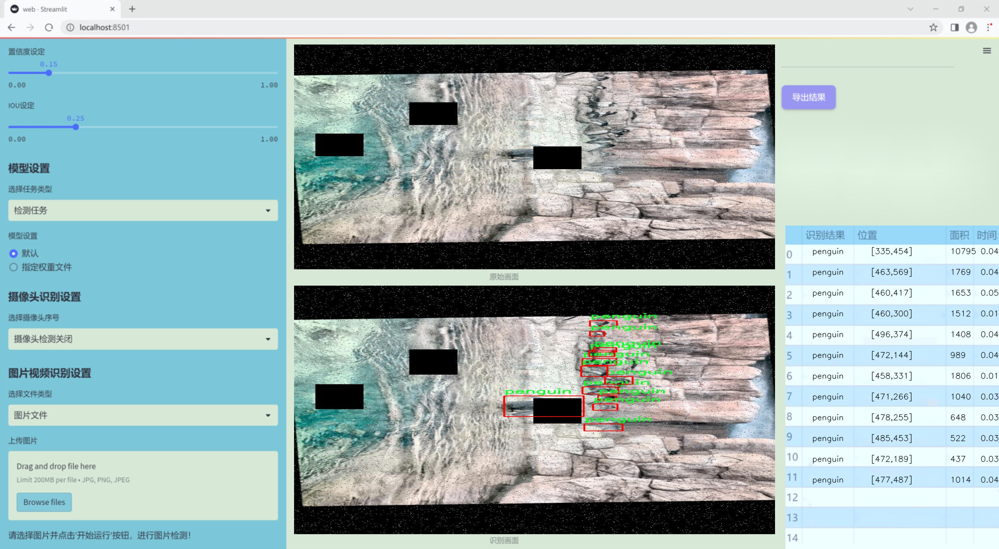
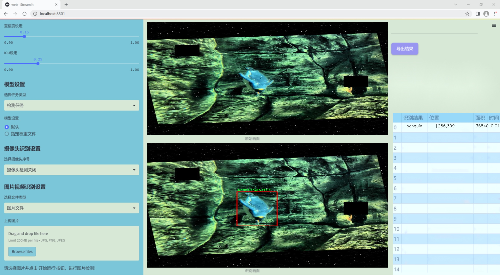
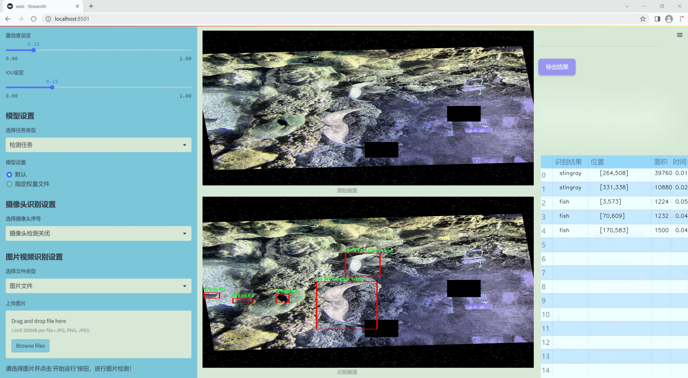
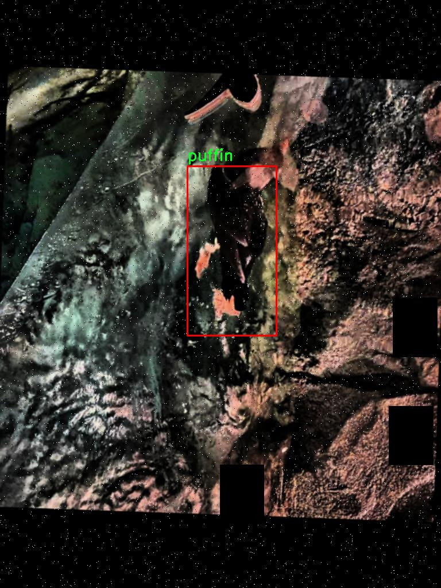
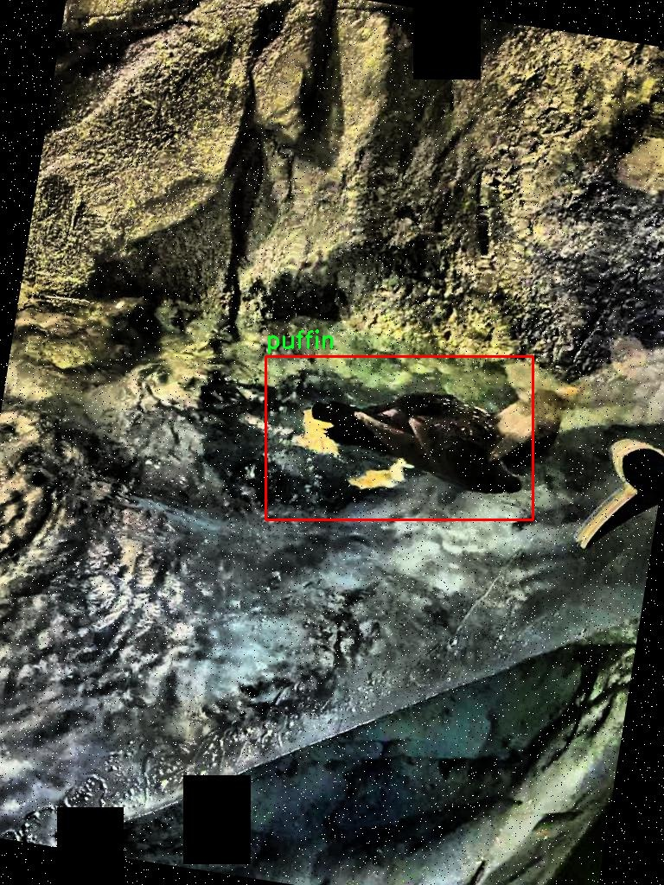
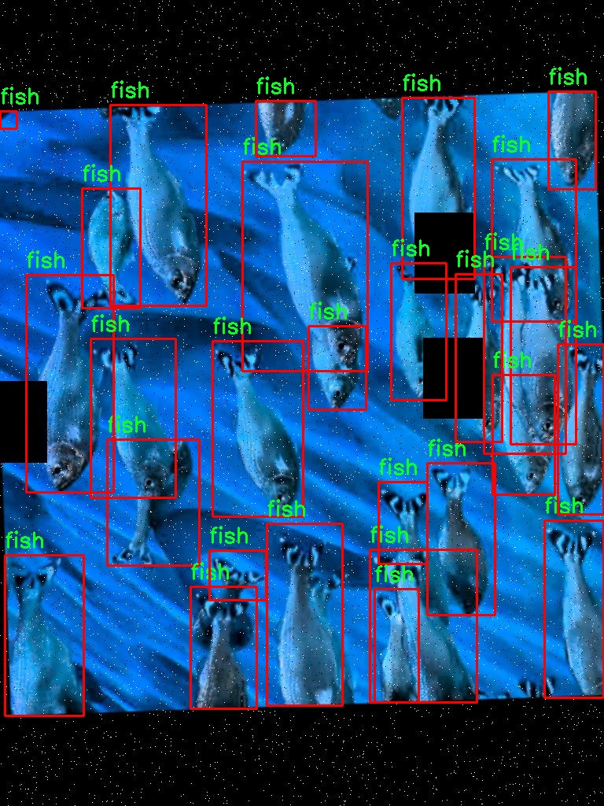
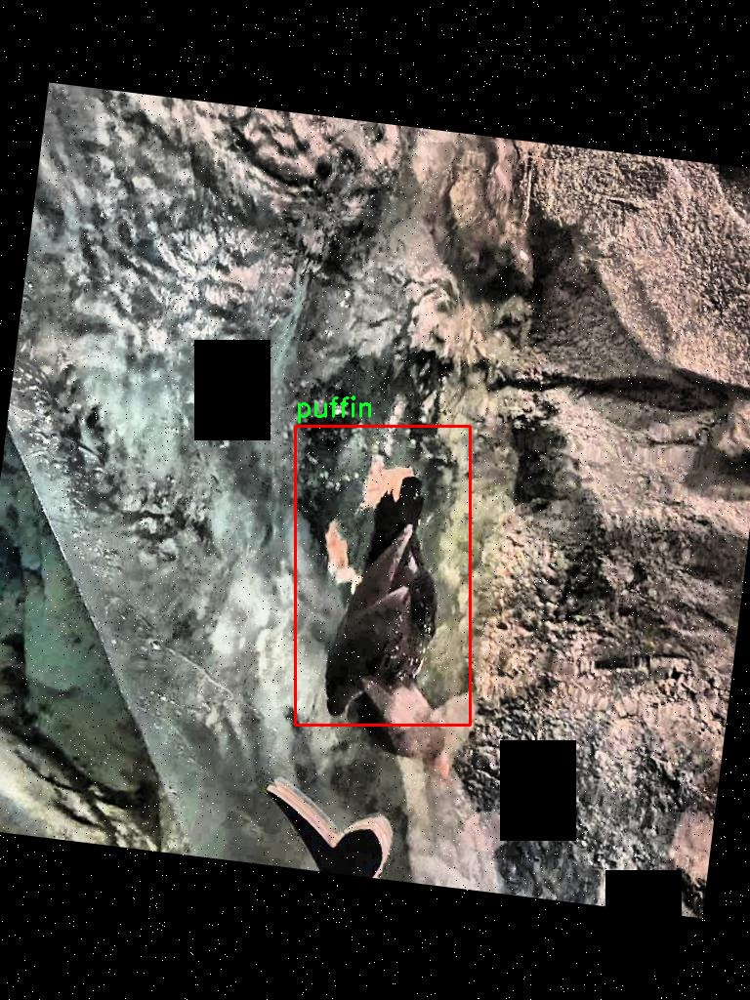
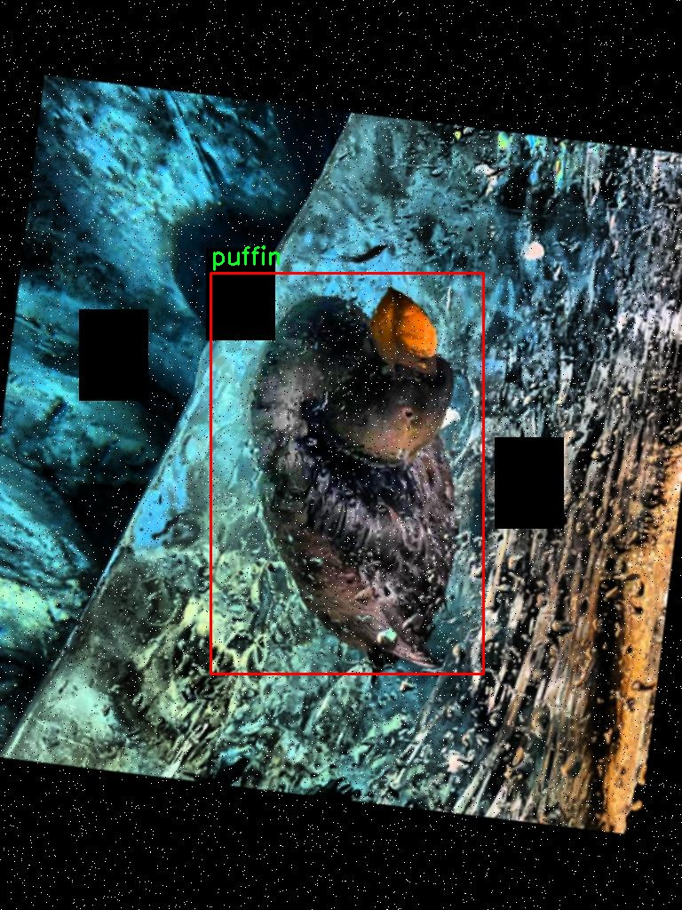

# 改进yolo11-DySnakeConv等200+全套创新点大全：水下生物检测系统源码＆数据集全套

### 1.图片效果展示







##### 项目来源 **[人工智能促进会 2024.10.28](https://kdocs.cn/l/cszuIiCKVNis)**

注意：由于项目一直在更新迭代，上面“1.图片效果展示”和“2.视频效果展示”展示的系统图片或者视频可能为老版本，新版本在老版本的基础上升级如下：（实际效果以升级的新版本为准）

  （1）适配了YOLOV11的“目标检测”模型和“实例分割”模型，通过加载相应的权重（.pt）文件即可自适应加载模型。

  （2）支持“图片识别”、“视频识别”、“摄像头实时识别”三种识别模式。

  （3）支持“图片识别”、“视频识别”、“摄像头实时识别”三种识别结果保存导出，解决手动导出（容易卡顿出现爆内存）存在的问题，识别完自动保存结果并导出到tempDir中。

  （4）支持Web前端系统中的标题、背景图等自定义修改。

  另外本项目提供训练的数据集和训练教程,暂不提供权重文件（best.pt）,需要您按照教程进行训练后实现图片演示和Web前端界面演示的效果。

### 2.视频效果展示

[2.1 视频效果展示](https://www.bilibili.com/video/BV1E515YfECd/)

### 3.背景

研究背景与意义

随着全球水域生态环境的日益恶化，水下生物的保护与监测变得愈发重要。水下生物多样性不仅对生态系统的健康至关重要，同时也对人类的可持续发展产生深远影响。近年来，深海探测和水下生物监测技术的进步，为科学家们提供了新的手段来研究和保护这些脆弱的生态系统。在此背景下，基于深度学习的目标检测技术逐渐成为水下生物监测的重要工具。YOLO（You Only Look Once）系列模型因其高效的实时检测能力而受到广泛关注，尤其是最新的YOLOv11版本，其在精度和速度上的优势使其成为水下生物检测的理想选择。

本研究旨在基于改进的YOLOv11模型，构建一个高效的水下生物检测系统。我们将利用DSCDayAquarium数据集，该数据集包含638幅图像，涵盖了多种水下生物类别，包括鱼类、海蜇、企鹅、海鸥、鲨鱼、海星和黄貂鱼等。这些类别的多样性为模型的训练和测试提供了丰富的样本，有助于提高检测的准确性和鲁棒性。通过对YOLOv11模型的改进，我们期望在保持高检测速度的同时，进一步提升模型在复杂水下环境中的检测性能。

此外，研究的意义不仅在于技术的创新，更在于其对水下生态保护的实际应用。通过实现高效的水下生物检测，我们能够更好地监测水下生物的种群变化，评估生态环境的健康状况，从而为科学研究和政策制定提供重要的数据支持。这一研究不仅有助于推动水下生物监测技术的发展，也为全球水域生态保护提供了新的思路和方法。

### 4.数据集信息展示

##### 4.1 本项目数据集详细数据（类别数＆类别名）

nc: 7
names: ['fish', 'jellyfish', 'penguin', 'puffin', 'shark', 'starfish', 'stingray']


该项目为【目标检测】数据集，请在【训练教程和Web端加载模型教程（第三步）】这一步的时候按照【目标检测】部分的教程来训练

##### 4.2 本项目数据集信息介绍

本项目数据集信息介绍

本项目所使用的数据集名为“DSCDayAquarium”，该数据集专为水下生物检测系统的训练而设计，旨在改进YOLOv11模型的性能，以实现更高效、更准确的水下生物识别。数据集中包含七个主要类别，分别为鱼类、海蜇、企鹅、海雀、鲨鱼、海星和黄貂鱼。这些类别涵盖了丰富多样的水下生物，能够为模型提供全面的训练样本，增强其在实际应用中的适应性和鲁棒性。

“DSCDayAquarium”数据集的构建经过精心设计，确保每个类别的样本数量均衡且具有代表性。这一策略不仅有助于减少模型在训练过程中的偏差，还能提升其在不同水下环境中的识别能力。数据集中每个类别的图像均为高质量的水下拍摄，捕捉了生物在自然栖息环境中的动态表现。这种多样化的图像来源，确保了模型在面对不同光照、角度和背景条件时，依然能够保持较高的识别准确率。

此外，数据集还包含了丰富的标注信息，为每个图像中的生物提供了精确的边界框和类别标签。这些标注不仅支持了YOLOv11模型的训练过程，还为后续的模型评估和优化提供了重要依据。通过使用“DSCDayAquarium”数据集，本项目期望能够显著提升水下生物检测系统的智能化水平，使其在实际应用中能够更好地服务于海洋生态监测、科研和保护等领域。总之，该数据集为改进YOLOv11模型提供了坚实的基础，助力实现更为精准的水下生物检测。











### 5.全套项目环境部署视频教程（零基础手把手教学）

[5.1 所需软件PyCharm和Anaconda安装教程（第一步）](https://www.bilibili.com/video/BV1BoC1YCEKi/?spm_id_from=333.999.0.0&vd_source=bc9aec86d164b67a7004b996143742dc)


[5.2 安装Python虚拟环境创建和依赖库安装视频教程（第二步）](https://www.bilibili.com/video/BV1ZoC1YCEBw?spm_id_from=333.788.videopod.sections&vd_source=bc9aec86d164b67a7004b996143742dc)

### 6.改进YOLOv11训练教程和Web_UI前端加载模型教程（零基础手把手教学）

[6.1 改进YOLOv11训练教程和Web_UI前端加载模型教程（第三步）](https://www.bilibili.com/video/BV1BoC1YCEhR?spm_id_from=333.788.videopod.sections&vd_source=bc9aec86d164b67a7004b996143742dc)


按照上面的训练视频教程链接加载项目提供的数据集，运行train.py即可开始训练



     Epoch   gpu_mem       box       obj       cls    labels  img_size
     1/200     20.8G   0.01576   0.01955  0.007536        22      1280: 100%|██████████| 849/849 [14:42<00:00,  1.04s/it]
               Class     Images     Labels          P          R     mAP@.5 mAP@.5:.95: 100%|██████████| 213/213 [01:14<00:00,  2.87it/s]
                 all       3395      17314      0.994      0.957      0.0957      0.0843

     Epoch   gpu_mem       box       obj       cls    labels  img_size
     2/200     20.8G   0.01578   0.01923  0.007006        22      1280: 100%|██████████| 849/849 [14:44<00:00,  1.04s/it]
               Class     Images     Labels          P          R     mAP@.5 mAP@.5:.95: 100%|██████████| 213/213 [01:12<00:00,  2.95it/s]
                 all       3395      17314      0.996      0.956      0.0957      0.0845

     Epoch   gpu_mem       box       obj       cls    labels  img_size
     3/200     20.8G   0.01561    0.0191  0.006895        27      1280: 100%|██████████| 849/849 [10:56<00:00,  1.29it/s]
               Class     Images     Labels          P          R     mAP@.5 mAP@.5:.95: 100%|███████   | 187/213 [00:52<00:00,  4.04it/s]
                 all       3395      17314      0.996      0.957      0.0957      0.0845


###### [项目数据集下载链接](https://kdocs.cn/l/cszuIiCKVNis)

### 7.原始YOLOv11算法讲解

YOLO11采用改进的骨干和颈部架构，增强了特征提取能力，提高了物体检测的精确度和复杂任务的表现。YOLO11引入精炼的架构设计和优化的训练流程，实现更快的处理速度，同时保持精度和性能之间的最佳平衡。通过模型设计的进步，YOLO11m在COCO数据集上实现了更高的均值平均精度（mAP），同时使用比YOLOv8m少22%的参数，使其在不妥协准确性的情况下更加计算高效。YOLO11可以无缝部署在各种环境中，包括边缘设备、云平台以及支持NVIDIA
GPU的系统，确保最大灵活性。无论是物体检测、实例分割、图像分类、姿态估计，还是定向物体检测（OBB），YOLO11都旨在应对多样的计算机视觉挑战。


##### **Ultralytics YOLO11相比于之前版本的主要改进有哪些？**

Ultralytics YOLO11在其前身基础上引入了几项重要进步。主要改进包括：

  1. **增强的特征提取** ：YOLO11采用改进的骨干和颈部架构，增强了特征提取能力，提高了物体检测的精确度。
  2.  **优化的效率和速度** ：精炼的架构设计和优化的训练流程实现了更快的处理速度，同时保持了准确性和性能之间的平衡。
  3.  **更高的准确性与更少的参数** ：YOLO11m在COCO数据集上实现了更高的均值平均精度（mAP），同时使用比YOLOv8m少22%的参数，使其在不妥协准确性的情况下更加计算高效。
  4.  **环境适应性强** ：YOLO11可以在多种环境中部署，包括边缘设备、云平台以及支持NVIDIA GPU的系统。
  5.  **支持广泛的任务** ：YOLO11支持多种计算机视觉任务，如物体检测、实例分割、图像分类、姿态估计和定向物体检测（OBB）。

我们先来看一下其网络结构有什么变化，可以看出，相比较于YOLOv8模型，其将CF2模块改成C3K2，同时在SPPF模块后面添加了一个C2PSA模块，且将YOLOv10的head思想引入到YOLO11的head中，使用深度可分离的方法，减少冗余计算，提高效率。下面我们来详细看一下这两个模块的结构是怎么构成的，以及它们为什么要这样设计


##### C3K2的网络结构

从下面图中我们可以看到，C3K2模块其实就是C2F模块转变出来的，它代码中有一个设置，就是当c3k这个参数为FALSE的时候，C3K2模块就是C2F模块，也就是说它的Bottleneck是普通的Bottleneck；反之当它为true的时候，将Bottleneck模块替换成C3模块。


##### C2PSA的网络结构

` `C2PSA是对 `C2f` 模块的扩展，它结合了PSA(Pointwise Spatial
Attention)块，用于增强特征提取和注意力机制。通过在标准 `C2f` 模块中引入 PSA
块，C2PSA实现了更强大的注意力机制，从而提高了模型对重要特征的捕捉能力。


##### **C2f 模块回顾：**

**** C2f模块是一个更快的 CSP（Cross Stage Partial）瓶颈实现，它通过两个卷积层和多个 Bottleneck
块进行特征提取。相比传统的 CSPNet，C2f 优化了瓶颈层的结构，使得计算速度更快。在 C2f中，`cv1` 是第一个 1x1
卷积，用于减少通道数；`cv2` 是另一个 1x1 卷积，用于恢复输出通道数。而 `n` 是一个包含 Bottleneck 块的数量，用于提取特征。

##### **C2PSA 模块的增强** ：

**C2PSA** 扩展了 C2f，通过引入PSA( **Position-Sensitive Attention)**
，旨在通过多头注意力机制和前馈神经网络来增强特征提取能力。它可以选择性地添加残差结构（shortcut）以优化梯度传播和网络训练效果。同时，使用FFN
可以将输入特征映射到更高维的空间，捕获输入特征的复杂非线性关系，允许模型学习更丰富的特征表示。

##### head部分

YOLO11在head部分的cls分支上使用深度可分离卷积 ，具体代码如下，cv2边界框回归分支，cv3分类分支。

    
    
     self.cv2 = nn.ModuleList(
                nn.Sequential(Conv(x, c2, 3), Conv(c2, c2, 3), nn.Conv2d(c2, 4 * self.reg_max, 1)) for x in ch
            )
            self.cv3 = nn.ModuleList(
                nn.Sequential(
                    nn.Sequential(DWConv(x, x, 3), Conv(x, c3, 1)),
                    nn.Sequential(DWConv(c3, c3, 3), Conv(c3, c3, 1)),
                    nn.Conv2d(c3, self.nc, 1),
                )
                for x in ch
            )


### 8.200+种全套改进YOLOV11创新点原理讲解

#### 8.1 200+种全套改进YOLOV11创新点原理讲解大全

由于篇幅限制，每个创新点的具体原理讲解就不全部展开，具体见下列网址中的改进模块对应项目的技术原理博客网址【Blog】（创新点均为模块化搭建，原理适配YOLOv5~YOLOv11等各种版本）

[改进模块技术原理博客【Blog】网址链接](https://gitee.com/qunmasj/good)


#### 8.2 精选部分改进YOLOV11创新点原理讲解

###### 这里节选部分改进创新点展开原理讲解(完整的改进原理见上图和[改进模块技术原理博客链接](https://gitee.com/qunmasj/good)【如果此小节的图加载失败可以通过CSDN或者Github搜索该博客的标题访问原始博客，原始博客图片显示正常】
### CBAM空间注意力机制
近年来，随着深度学习研究方向的火热，注意力机制也被广泛地应用在图像识别、语音识别和自然语言处理等领域，注意力机制在深度学习任务中发挥着举足轻重的作用。注意力机制借鉴于人类的视觉系统，例如，人眼在看到一幅画面时，会倾向于关注画面中的重要信息，而忽略其他可见的信息。深度学习中的注意力机制和人类视觉的注意力机制相似，通过扫描全局数据，从大量数据中选择出需要重点关注的、对当前任务更为重要的信息，然后对这部分信息分配更多的注意力资源，从这些信息中获取更多所需要的细节信息，而抑制其他无用的信息。而在深度学习中，则具体表现为给感兴趣的区域更高的权重，经过网络的学习和调整，得到最优的权重分配，形成网络模型的注意力，使网络拥有更强的学习能力，加快网络的收敛速度。
注意力机制通常可分为软注意力机制和硬注意力机制[4-5]。软注意力机制在选择信息时，不是从输入的信息中只选择1个，而会用到所有输入信息，只是各个信息对应的权重分配不同，然后输入网络模型进行计算;硬注意力机制则是从输入的信息中随机选取一个或者选择概率最高的信息，但是这一步骤通常是不可微的，导致硬注意力机制更难训练。因此，软注意力机制应用更为广泛，按照原理可将软注意力机制划分为:通道注意力机制（channel attention)、空间注意力机制(spatial attention）和混合域注意力机制(mixed attention)。
通道注意力机制的本质建立各个特征通道之间的重要程度，对感兴趣的通道进行重点关注，弱化不感兴趣的通道的作用;空间注意力的本质则是建模了整个空间信息的重要程度，然后对空间内感兴趣的区域进行重点关注，弱化其余非感兴趣区域的作用;混合注意力同时运用了通道注意力和空间注意力，两部分先后进行或并行，形成对通道特征和空间特征同时关注的注意力模型。

卷积层注意力模块(Convolutional Block Attention Module，CBAM）是比较常用的混合注意力模块，其先后集中了通道注意力模块和空间注意力模块，网络中加入该模块能有效提高网络性能，减少网络模型的计算量，模块结构如图所示。输入特征图首先经过分支的通道注意力模块，然后和主干的原特征图融合，得到具有通道注意力的特征图，接着经过分支的空间注意力模块，在和主干的特征图融合后，得到同时具有通道特征注意力和空间特征注意力的特征图。CBAM模块不改变输入特征图的大小，因此该模块是一个“即插即用”的模块，可以插入网络的任何位置。

通道注意力模块的结构示意图如图所示，通道注意力模块分支并行地对输入的特征图进行最大池化操作和平均池化操作，然后利用多层感知机对结果进行变换，得到应用于两个通道的变换结果，最后经过sigmoid激活函数将变换结果融合，得到具有通道注意力的通道特征图。

空间注意力模块示意图如图所示，将通道注意力模块输出的特征图作为该模块的输入特征图，首先对输入特征图进行基于通道的最大池化操作和平均池化操作，将两部分得到的结果拼接起来，然后通过卷积得到降为Ⅰ通道的特征图，最后通过sigmoid激活函数生成具有空间注意力的特征图。


### 9.系统功能展示

图9.1.系统支持检测结果表格显示

  图9.2.系统支持置信度和IOU阈值手动调节

  图9.3.系统支持自定义加载权重文件best.pt(需要你通过步骤5中训练获得)

  图9.4.系统支持摄像头实时识别

  图9.5.系统支持图片识别

  图9.6.系统支持视频识别

  图9.7.系统支持识别结果文件自动保存

  图9.8.系统支持Excel导出检测结果数据


### 10. YOLOv11核心改进源码讲解

#### 10.1 prepbn.py

以下是对代码的逐文件分析，保留了核心部分并进行了详细的中文注释：

```python
import torch
import torch.nn as nn

# 定义一个自定义的批量归一化层，称为 RepBN
class RepBN(nn.Module):
    def __init__(self, channels):
        super(RepBN, self).__init__()
        # alpha 是一个可学习的参数，初始化为 1
        self.alpha = nn.Parameter(torch.ones(1))
        # 使用 PyTorch 的 BatchNorm1d 进行一维批量归一化
        self.bn = nn.BatchNorm1d(channels)

    def forward(self, x):
        # 将输入的维度进行转置，以适应 BatchNorm1d 的输入格式
        x = x.transpose(1, 2)
        # 进行批量归一化，并加上 alpha * x
        x = self.bn(x) + self.alpha * x
        # 再次转置回原来的维度
        x = x.transpose(1, 2)
        return x

# 定义一个线性归一化层，称为 LinearNorm
class LinearNorm(nn.Module):
    def __init__(self, dim, norm1, norm2, warm=0, step=300000, r0=1.0):
        super(LinearNorm, self).__init__()
        # 注册一些缓冲区，用于控制训练过程中的状态
        self.register_buffer('warm', torch.tensor(warm))  # 预热步数
        self.register_buffer('iter', torch.tensor(step))   # 当前迭代步数
        self.register_buffer('total_step', torch.tensor(step))  # 总步数
        self.r0 = r0  # 初始比例
        # norm1 和 norm2 是两个归一化层，dim 是输入的维度
        self.norm1 = norm1(dim)
        self.norm2 = norm2(dim)

    def forward(self, x):
        if self.training:  # 如果模型处于训练模式
            if self.warm > 0:  # 如果还有预热步数
                self.warm.copy_(self.warm - 1)  # 减少预热步数
                x = self.norm1(x)  # 使用 norm1 进行归一化
            else:
                # 计算当前的 lamda 值
                lamda = self.r0 * self.iter / self.total_step
                if self.iter > 0:
                    self.iter.copy_(self.iter - 1)  # 减少迭代步数
                # 使用 norm1 和 norm2 进行归一化
                x1 = self.norm1(x)
                x2 = self.norm2(x)
                # 线性组合两个归一化的结果
                x = lamda * x1 + (1 - lamda) * x2
        else:
            # 如果模型不在训练模式，直接使用 norm2 进行归一化
            x = self.norm2(x)
        return x
```

### 代码核心部分说明：
1. **RepBN 类**：实现了一个自定义的批量归一化层，允许通过可学习的参数 `alpha` 对输入进行加权，增强了模型的表达能力。
2. **LinearNorm 类**：实现了一个线性归一化层，结合了两个不同的归一化方法（`norm1` 和 `norm2`），并通过一个动态的 `lamda` 值在训练过程中逐步调整归一化的方式，提供了更灵活的训练策略。预热机制 (`warm`) 使得在训练初期能够平滑过渡到正常的归一化策略。

这个文件定义了两个主要的类：`RepBN` 和 `LinearNorm`，它们都是基于 PyTorch 的神经网络模块。

首先，`RepBN` 类是一个自定义的批量归一化（Batch Normalization）模块。它的构造函数接收一个参数 `channels`，表示输入数据的通道数。在初始化过程中，它定义了一个可学习的参数 `alpha`，并创建了一个标准的 `BatchNorm1d` 实例。`forward` 方法实现了前向传播，首先将输入张量 `x` 的维度进行转置，以适应批量归一化的要求。接着，调用批量归一化层对转置后的 `x` 进行处理，并将处理结果与 `alpha` 乘以原始输入 `x` 相加。最后，再次转置结果，以恢复原来的维度并返回。

接下来是 `LinearNorm` 类，它实现了一种线性归一化策略。构造函数接收多个参数，包括 `dim`（维度）、`norm1` 和 `norm2`（分别是两个归一化函数）、`warm`（预热步数）、`step`（总步数）和 `r0`（初始比例）。在初始化过程中，使用 `register_buffer` 方法注册了一些张量，以便在模型训练时保持其状态。`forward` 方法根据模型的训练状态执行不同的操作。如果模型处于训练状态且 `warm` 大于零，则执行第一次归一化 `norm1`，并将 `warm` 减一。否则，计算一个动态的比例 `lamda`，并根据当前的迭代次数更新 `iter`。然后，分别对输入 `x` 应用 `norm1` 和 `norm2`，并根据计算出的 `lamda` 进行线性组合。如果模型不在训练状态，则直接使用 `norm2` 对输入进行归一化处理。

总体而言，这两个类实现了自定义的归一化策略，旨在提高神经网络的训练效果和稳定性。`RepBN` 提供了一种带有可学习参数的批量归一化，而 `LinearNorm` 则结合了两种归一化方法，并通过动态调整比例来平衡它们的影响。

#### 10.2 orepa.py

以下是代码中最核心的部分，并附上详细的中文注释：

```python
import torch
import torch.nn as nn
import torch.nn.functional as F
import numpy as np

# 定义一个OREPA模块
class OREPA(nn.Module):
    def __init__(self, in_channels, out_channels, kernel_size=3, stride=1, padding=None, groups=1, dilation=1, act=True):
        super(OREPA, self).__init__()
        
        # 初始化参数
        self.in_channels = in_channels
        self.out_channels = out_channels
        self.kernel_size = kernel_size
        self.stride = stride
        self.padding = padding if padding is not None else (kernel_size // 2)
        self.groups = groups
        self.dilation = dilation
        
        # 激活函数
        self.nonlinear = nn.ReLU() if act else nn.Identity()
        
        # 定义权重参数
        self.weight_orepa_origin = nn.Parameter(torch.Tensor(out_channels, in_channels // groups, kernel_size, kernel_size))
        nn.init.kaiming_uniform_(self.weight_orepa_origin)  # 使用Kaiming初始化
        
        # 定义其他卷积层的权重
        self.weight_orepa_avg_conv = nn.Parameter(torch.Tensor(out_channels, in_channels // groups, 1, 1))
        nn.init.kaiming_uniform_(self.weight_orepa_avg_conv)
        
        self.weight_orepa_1x1 = nn.Parameter(torch.Tensor(out_channels, in_channels // groups, 1, 1))
        nn.init.kaiming_uniform_(self.weight_orepa_1x1)

        # 初始化向量，用于加权不同的卷积分支
        self.vector = nn.Parameter(torch.Tensor(3, out_channels))
        nn.init.constant_(self.vector[0, :], 1.0)  # origin
        nn.init.constant_(self.vector[1, :], 0.5)  # avg
        nn.init.constant_(self.vector[2, :], 0.5)  # 1x1

    def weight_gen(self):
        # 生成最终的卷积权重
        weight_orepa_origin = self.weight_orepa_origin * self.vector[0, :].view(-1, 1, 1, 1)
        weight_orepa_avg = self.weight_orepa_avg_conv * self.vector[1, :].view(-1, 1, 1, 1)
        weight_orepa_1x1 = self.weight_orepa_1x1 * self.vector[2, :].view(-1, 1, 1, 1)

        # 合并所有权重
        weight = weight_orepa_origin + weight_orepa_avg + weight_orepa_1x1
        return weight

    def forward(self, inputs):
        # 生成权重并进行卷积操作
        weight = self.weight_gen()
        out = F.conv2d(inputs, weight, stride=self.stride, padding=self.padding, dilation=self.dilation, groups=self.groups)
        return self.nonlinear(out)  # 应用激活函数

# 定义一个使用OREPA的RepVGG模块
class RepVGGBlock_OREPA(nn.Module):
    def __init__(self, in_channels, out_channels, kernel_size=3, stride=1, padding=None, groups=1, act=True):
        super(RepVGGBlock_OREPA, self).__init__()
        
        # 初始化参数
        self.in_channels = in_channels
        self.out_channels = out_channels
        self.stride = stride
        self.padding = padding if padding is not None else (kernel_size // 2)
        self.groups = groups
        
        # 激活函数
        self.nonlinearity = nn.ReLU() if act else nn.Identity()
        
        # 定义OREPA模块
        self.rbr_dense = OREPA(in_channels, out_channels, kernel_size=kernel_size, stride=stride, padding=self.padding, groups=groups)

    def forward(self, inputs):
        # 通过OREPA模块进行前向传播
        out = self.rbr_dense(inputs)
        return self.nonlinearity(out)  # 应用激活函数
```

### 代码注释说明：
1. **OREPA类**：
   - 该类实现了一个自定义的卷积模块，允许通过不同的卷积分支生成最终的卷积权重。
   - `weight_gen`方法生成最终的卷积权重，通过对不同卷积分支的权重进行加权和合并。
   - `forward`方法实现了前向传播，使用生成的权重进行卷积操作。

2. **RepVGGBlock_OREPA类**：
   - 该类实现了一个使用OREPA模块的RepVGG块。
   - 在初始化时创建一个OREPA实例作为主要的卷积层。
   - `forward`方法实现了输入的前向传播，返回经过激活函数处理的输出。

通过这些核心部分和注释，可以更好地理解代码的结构和功能。

这个程序文件 `orepa.py` 是一个实现了 OREPA（一个用于深度学习的卷积神经网络模块）的 PyTorch 模块。它包含多个类和函数，主要用于构建和优化卷积层，特别是在模型部署时的权重转换和融合。

首先，文件中导入了一些必要的库，包括 PyTorch 和 NumPy，以及一些自定义的模块（如 `autopad` 和 `SEAttention`）。这些导入为后续的卷积操作和注意力机制提供了支持。

文件中定义了几个函数，`transI_fusebn` 和 `transVI_multiscale` 是用于权重转换的工具函数。`transI_fusebn` 用于将卷积层的权重与批归一化层的参数融合，返回融合后的卷积核和偏置。`transVI_multiscale` 则用于对卷积核进行多尺度填充，以适应不同的目标卷积核大小。

接下来是 `OREPA` 类的定义，这是文件的核心部分。`OREPA` 类继承自 `nn.Module`，并在初始化方法中定义了多个参数，包括输入输出通道数、卷积核大小、步幅、填充、分组卷积等。根据是否在部署模式下，类会初始化不同的卷积层参数。

在 `OREPA` 类中，权重的生成和初始化是通过 `weight_gen` 方法实现的。该方法使用爱因斯坦求和约定（`torch.einsum`）来计算不同卷积分支的权重，并将它们组合成最终的卷积权重。`forward` 方法定义了前向传播过程，包括对输入数据的卷积操作和非线性激活。

`OREPA_LargeConv` 类是一个扩展版本，支持更大的卷积核，并在初始化时创建多个 `OREPA` 实例，以便于堆叠卷积层。它同样实现了权重生成和前向传播的方法。

`ConvBN` 类则是一个简单的卷积层和批归一化层的组合，提供了权重融合的功能。

`OREPA_3x3_RepVGG` 类是专门为 3x3 卷积设计的，包含多个分支以支持不同的卷积操作，并且可以在部署时将权重融合。

最后，`RepVGGBlock_OREPA` 类是整个模块的一个块，结合了多个卷积层和可能的注意力机制，支持在训练和部署模式之间切换。

总体来说，这个文件实现了一个灵活且高效的卷积神经网络模块，能够在训练和推理阶段之间进行权重转换和优化，以提高模型的性能和部署效率。

#### 10.3 val.py

以下是经过简化和注释的核心代码部分，主要集中在 `DetectionValidator` 类及其关键方法上：

```python
import os
import torch
from ultralytics.engine.validator import BaseValidator
from ultralytics.utils.metrics import DetMetrics, ConfusionMatrix
from ultralytics.utils import ops

class DetectionValidator(BaseValidator):
    """
    扩展自 BaseValidator 类的检测模型验证器。
    """

    def __init__(self, dataloader=None, save_dir=None, pbar=None, args=None, _callbacks=None):
        """初始化检测模型所需的变量和设置。"""
        super().__init__(dataloader, save_dir, pbar, args, _callbacks)
        self.metrics = DetMetrics(save_dir=self.save_dir)  # 初始化检测指标
        self.confusion_matrix = ConfusionMatrix(nc=len(args.names), conf=args.conf)  # 初始化混淆矩阵

    def preprocess(self, batch):
        """对图像批次进行预处理。"""
        # 将图像转移到设备上并进行归一化
        batch["img"] = batch["img"].to(self.device, non_blocking=True) / 255
        # 将其他数据转移到设备上
        for k in ["batch_idx", "cls", "bboxes"]:
            batch[k] = batch[k].to(self.device)
        return batch

    def postprocess(self, preds):
        """对预测结果应用非极大值抑制（NMS）。"""
        return ops.non_max_suppression(
            preds,
            self.args.conf,
            self.args.iou,
            multi_label=True,
            agnostic=self.args.single_cls,
            max_det=self.args.max_det,
        )

    def update_metrics(self, preds, batch):
        """更新检测指标。"""
        for si, pred in enumerate(preds):
            npr = len(pred)  # 当前预测的数量
            pbatch = self._prepare_batch(si, batch)  # 准备当前批次的数据
            cls, bbox = pbatch.pop("cls"), pbatch.pop("bbox")  # 获取真实标签
            if npr == 0:
                continue  # 如果没有预测，跳过

            # 处理预测
            predn = self._prepare_pred(pred, pbatch)  # 准备预测数据
            stat = {
                "conf": predn[:, 4],  # 置信度
                "pred_cls": predn[:, 5],  # 预测类别
                "tp": self._process_batch(predn, bbox, cls)  # 计算真正例
            }
            # 更新混淆矩阵
            self.confusion_matrix.process_batch(predn, bbox, cls)

    def get_stats(self):
        """返回指标统计信息和结果字典。"""
        stats = {k: torch.cat(v, 0).cpu().numpy() for k, v in self.stats.items()}  # 转换为numpy数组
        if len(stats) and stats["tp"].any():
            self.metrics.process(**stats)  # 处理指标
        return self.metrics.results_dict  # 返回结果字典

    def print_results(self):
        """打印每个类别的训练/验证集指标。"""
        pf = "%22s" + "%11i" * 2 + "%11.3g" * len(self.metrics.keys)  # 打印格式
        # 打印整体结果
        LOGGER.info(pf % ("all", self.seen, self.nt_per_class.sum(), *self.metrics.mean_results()))
        # 打印每个类别的结果
        for i, c in enumerate(self.metrics.ap_class_index):
            LOGGER.info(pf % (self.names[c], self.seen, self.nt_per_class[c], *self.metrics.class_result(i)))

    def _process_batch(self, detections, gt_bboxes, gt_cls):
        """
        返回正确的预测矩阵。
        """
        iou = box_iou(gt_bboxes, detections[:, :4])  # 计算IoU
        return self.match_predictions(detections[:, 5], gt_cls, iou)  # 匹配预测与真实标签
```

### 代码说明：
1. **DetectionValidator 类**：这是一个用于检测模型验证的类，继承自 `BaseValidator`。它负责处理验证过程中的数据预处理、指标更新和结果打印等任务。

2. **__init__ 方法**：初始化验证器，设置保存目录、指标和混淆矩阵。

3. **preprocess 方法**：对输入的图像批次进行预处理，包括将图像转移到指定设备上并进行归一化处理。

4. **postprocess 方法**：对模型的预测结果应用非极大值抑制（NMS），以减少重复的检测框。

5. **update_metrics 方法**：更新当前批次的检测指标，包括计算真正例和更新混淆矩阵。

6. **get_stats 方法**：收集并返回当前的指标统计信息。

7. **print_results 方法**：打印整体和每个类别的验证结果。

8. **_process_batch 方法**：计算IoU并返回正确的预测矩阵，用于评估模型的性能。

这个程序文件 `val.py` 是一个用于YOLO（You Only Look Once）目标检测模型验证的实现。它主要通过继承自 `BaseValidator` 类，提供了一系列用于处理和评估目标检测任务的功能。

首先，程序导入了必要的库和模块，包括操作系统相关的模块、路径处理模块、NumPy、PyTorch以及Ultralytics提供的相关工具和数据处理模块。接着，定义了 `DetectionValidator` 类，该类专门用于基于检测模型的验证。

在类的初始化方法中，设置了一些基本参数和变量，包括数据加载器、保存目录、进度条、参数等。它还初始化了一些与评估相关的指标，如 `DetMetrics` 和混淆矩阵。类中定义了一些方法来处理图像数据、初始化评估指标、处理预测结果等。

`preprocess` 方法负责对输入的图像批次进行预处理，包括将图像转换为适合模型输入的格式，并将标签和边界框转换到相应的设备上。`init_metrics` 方法则用于初始化评估指标，包括判断数据集是否为COCO格式，并设置相应的类别映射。

在处理预测结果时，`postprocess` 方法应用非极大值抑制（NMS）来过滤掉冗余的预测框。`update_metrics` 方法用于更新评估指标，包括处理每个批次的预测和真实标签，计算正确预测的数量等。

`finalize_metrics` 方法在所有批次处理完成后设置最终的评估指标，`get_stats` 方法则返回计算得到的指标统计信息。`print_results` 方法负责打印每个类别的评估结果，包括每个类别的图像数量、实例数量和各种指标。

此外，程序还包含了一些辅助方法，如 `build_dataset` 和 `get_dataloader` 用于构建数据集和数据加载器，`plot_val_samples` 和 `plot_predictions` 用于可视化验证样本和预测结果，`save_one_txt` 和 `pred_to_json` 用于将预测结果保存为文本文件或JSON格式。

最后，`eval_json` 方法用于评估YOLO输出的JSON格式结果，并返回性能统计信息，特别是与COCO数据集的评估相关的指标。

总体来说，这个程序文件实现了YOLO模型在验证阶段的各项功能，包括数据预处理、指标计算、结果可视化和保存等，适用于目标检测任务的评估和分析。

#### 10.4 test_selective_scan_easy.py


这个文件 `test_selective_scan_easy.py` 是一个用于测试选择性扫描（Selective Scan）操作的 Python 脚本，主要使用 PyTorch 框架进行深度学习相关的计算。文件中包含了选择性扫描的实现、反向传播的计算以及一系列的单元测试。

首先，文件导入了必要的库，包括 `torch` 和 `pytest`，并定义了一些常量和函数。`selective_scan_easy` 函数是核心函数，负责执行选择性扫描操作。它的输入包括多个张量，代表不同的参数和状态。函数内部定义了一个 `selective_scan_chunk` 的辅助函数，用于处理输入数据的分块扫描。

在 `selective_scan_easy` 函数中，首先对输入数据进行类型转换和形状调整。然后，通过循环将输入数据分成小块（chunks），并调用 `selective_scan_chunk` 函数进行逐块处理。每次处理后，结果会被存储并最终合并成一个完整的输出。

`SelectiveScanEasy` 类是一个自定义的 PyTorch 自动求导函数，包含了前向传播和反向传播的实现。前向传播中，函数会根据输入的参数计算输出，并保存中间结果以便反向传播使用。反向传播中，函数会根据输出的梯度计算输入的梯度。

文件还定义了多个版本的选择性扫描函数（如 `selective_scan_easyv2` 和 `selective_scan_easyv3`），这些版本可能在实现细节上有所不同，以适应不同的需求或优化性能。

最后，文件包含了一个名为 `test_selective_scan` 的测试函数，使用 `pytest` 框架对选择性扫描的实现进行单元测试。测试函数会根据不同的参数组合生成随机输入数据，并调用选择性扫描函数进行计算。然后，测试函数会比较选择性扫描的输出与参考实现的输出，确保它们在数值上相近。

总的来说，这个文件实现了选择性扫描的算法，并通过一系列的测试确保其正确性和稳定性，适用于深度学习模型中的序列数据处理。

注意：由于此博客编辑较早，上面“10.YOLOv11核心改进源码讲解”中部分代码可能会优化升级，仅供参考学习，以“11.完整训练+Web前端界面+200+种全套创新点源码、数据集获取”的内容为准。

### 11.完整训练+Web前端界面+200+种全套创新点源码、数据集获取


# [下载链接：https://mbd.pub/o/bread/Zp6XlJ5w](https://mbd.pub/o/bread/Zp6XlJ5w)